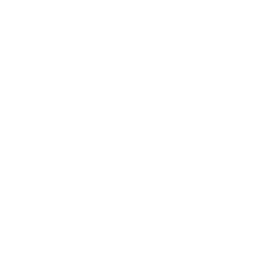

  <!---->
  

  
  
  

  

## 关于我

<table width="100%">
  <tr>
    <td width="30%" align="center">
      
    </td>
    <td width="70%" align="left">
      

        这里主要记录我做过的游戏项目、Godot 相关尝试，以及一些有意思的小玩意。 
        同时也是一名 B 站 UP 主，喜欢把灵感做成真正能玩、能跑、能分享的东西。
      

    </td>
  </tr>
</table>

<table>
  <tr>
    <td width="50%">
      

        
      

       
      

        
      

      

        
      

      

        
      

      

        
      

       
      

        
        
        
      

    </td>
    <td width="50%">
      <strong>主要技术栈</strong>
      

        
        
        
        
        
        
        
        
        
        
      

      <strong>频道</strong>
      

        
      

      <strong>重点</strong>
      
游戏开发 Godot 工具 二创模组

    </td>
  </tr>
</table>

<table>
  <tr>
    <td width="50%">
      <picture>
        <source media="(prefers-color-scheme: dark)" srcset="https://github-readme-stats.vercel.app/api?username=Yanxiyimengya&show_icons=true&hide_border=true&rank_icon=github&include_all_commits=true&theme=github_dark_dimmed" />
        <source media="(prefers-color-scheme: light)" srcset="https://github-readme-stats.vercel.app/api?username=Yanxiyimengya&show_icons=true&hide_border=true&rank_icon=github&include_all_commits=true&theme=default" />
        
      </picture>
    </td>
    <td width="50%">
      <picture>
        <source media="(prefers-color-scheme: dark)" srcset="https://github-readme-stats.vercel.app/api/top-langs/?username=Yanxiyimengya&layout=compact&hide_border=true&langs_count=8&theme=github_dark_dimmed" />
        <source media="(prefers-color-scheme: light)" srcset="https://github-readme-stats.vercel.app/api/top-langs/?username=Yanxiyimengya&layout=compact&hide_border=true&langs_count=8&theme=default" />
        
      </picture>
    </td>
  </tr>
</table>

  <picture>
    <source media="(prefers-color-scheme: dark)" srcset="https://streak-stats.demolab.com?user=Yanxiyimengya&hide_border=true&theme=dark&locale=zh_Hans" />
    <source media="(prefers-color-scheme: light)" srcset="https://streak-stats.demolab.com?user=Yanxiyimengya&hide_border=true&theme=default&locale=zh_Hans" />
    
  </picture>

  <picture>
    <source media="(prefers-color-scheme: dark)" srcset="https://github-readme-activity-graph.vercel.app/graph?username=Yanxiyimengya&bg_color=0d1117&color=7dd3fc&line=38bdf8&point=ffffff&area=true&hide_border=true" />
    <source media="(prefers-color-scheme: light)" srcset="https://github-readme-activity-graph.vercel.app/graph?username=Yanxiyimengya&bg_color=ffffff&color=0f172a&line=0284c7&point=0369a1&area=true&hide_border=true" />
    
  </picture>

  
  

  Email : 193446537@qq.com

  <!---->
  

